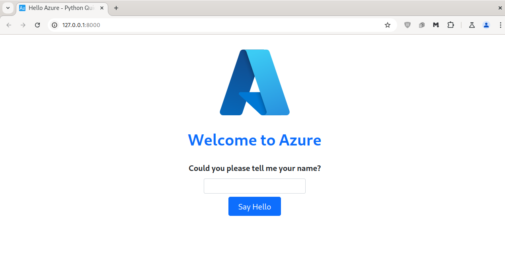
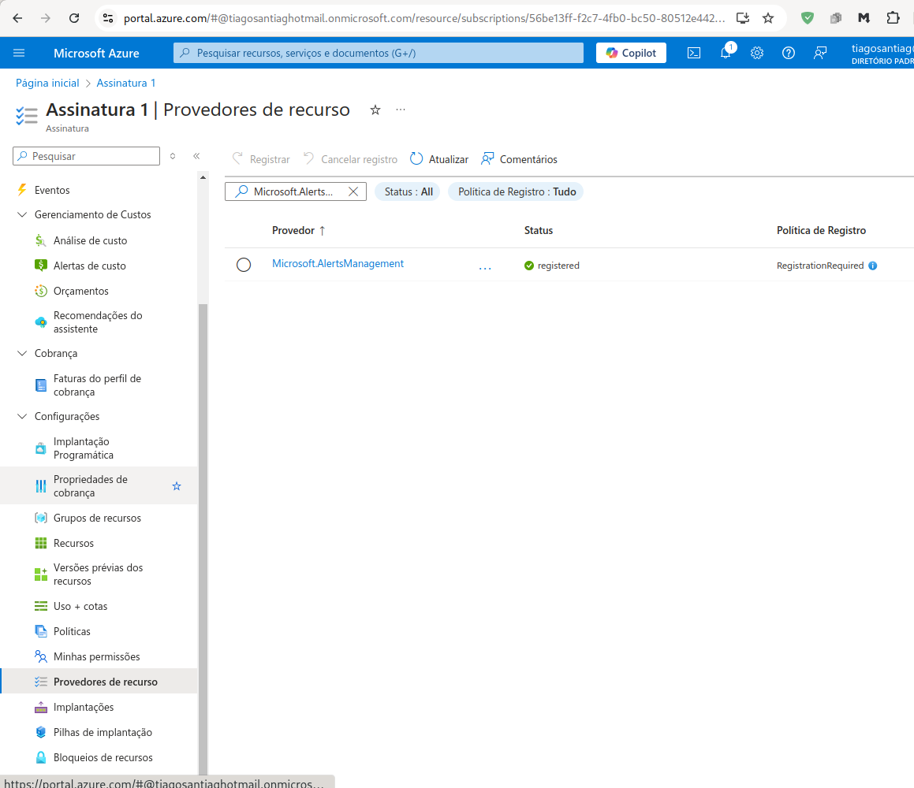
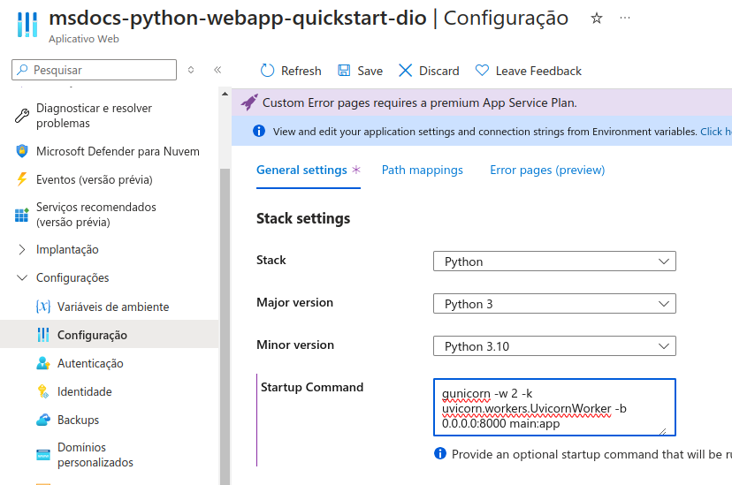
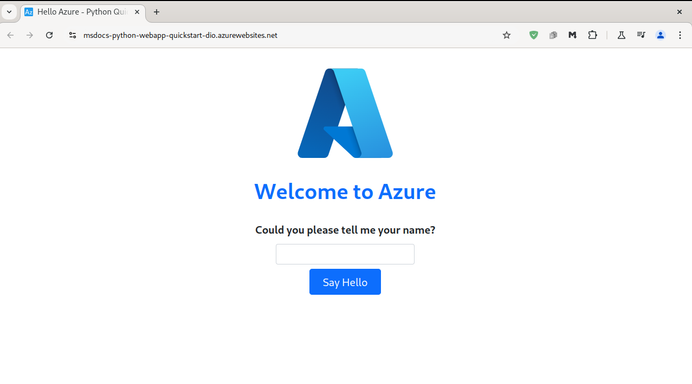

<h1>
<a href="https://www.dio.me/">
     </a>
    <span>Bootcamp Microsoft Certification Challenge #2 AZ-204</span>
</h1>


# :computer: Como Fazer o Deploy de uma API na Nuvem na Prática

Nesse projeto vamos seguir o tutorial da Microsoft Learn [para deploy de um web app com python](https://learn.microsoft.com/en-us/azure/app-service/quickstart-python?tabs=fastapi%2Cmac-linux%2Cvscode-aztools%2Cvscode-deploy%2Cdeploy-instructions-azportal%2Cterminal-bash%2Cdeploy-instructions-zip-azcli)

# :bulb: Solução do Desafio

## Baixando e testando a API 

Clonando a API feita com FastAPI:

```console
$git clone https://github.com/Azure-Samples/msdocs-python-fastapi-webapp-quickstart.git
```
Criando o ambiente virtual

```console
$ cd msdocs-python-fastapi-webapp-quickstart
$ python -m venv .venv source .venv/bin/activate
```
Instalando dependências 
```console
$ pip install -r requirements.txt
```

Rodando o aplicativo localmente

```console
$ uvicorn main:app --reload
```

<p align=center>

</p>

## Criando o web app no Azure

Vamos utilizar o [Azurre Tools](https://marketplace.visualstudio.com/items?itemName=ms-vscode.vscode-node-azure-pack) no VSCode.

O deployment falhou, foi necessário registrar `Microsoft.AlertsManagement` na Assinatura em Provedor de recursos.

<p align=center>

</p>

Na extensão do Azure Tools no VSCode

- RESOURCES: selecionar a assinatura

- Clicar em + e criar recurso: Create App Service Web App 

- Nome do aplicativo: msdocs-python-webapp-quickstart-dio

- Selecionar runtime: python 3.10

- Em service plan: Basic (B1)

- Na notificação de Created new web app, selecionar deploy

O deploy falhou novamente com o erro:
```console
Error: Couldn't detect a version for the platform 'python' in the repo.
```

Criei o arquivo `runtime.txt` com conteúdo
```
python-3.10
```
E o arquivo `.deployment` com conteúdo
```
[config]
SCM_DO_BUILD_DURING_DEPLOYMENT = true
```

Ao refazer o deployment obtive sucesso!

### Configurando script de inicialização

Como utilizei o fastAPI é necessário configurar o script de inicialização, utilizei o portal do Azure:

<p align=center>

</p>

Finalmente acessei o app pela URL  

<p align=center>

</p>

