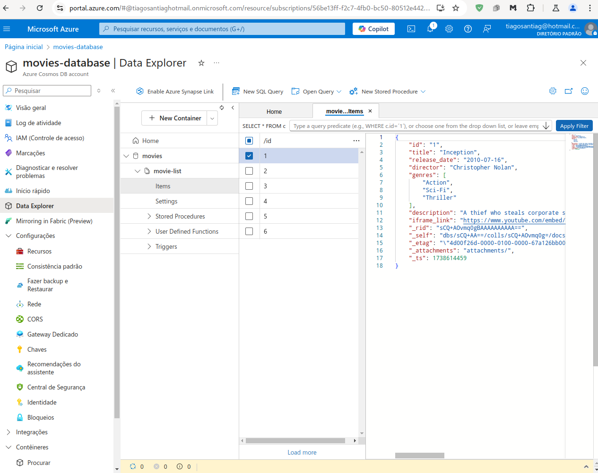

<h1>
<a href="https://www.dio.me/">
     </a>
    <span>Bootcamp Microsoft Certification Challenge #2 AZ-204</span>
</h1>


# :computer: Criando um Gerenciador de Catálogos da Netflix com Azure Functions e Banco de Dados
## Site para listar filmes

Criei um simples site para listar filmes utilizando iframes do youtube. Os dados dos filmes serão upados para um banco de dados do CosmosDB.  

Estrutura site:
```console
MoviesList
├── function_app.py
├── import.js
├── index.html
├── movies.json
├── README.md
├── script_local.js
└── styles.css
````

Estrutura da entrada no banco de dados, dados no arquivo `movies.json`

```js
[
    {
      "id": "1",
      "title": "Inception",
      "release_date": "2010-07-16",
      "director": "Christopher Nolan",
      "genres": ["Action", "Sci-Fi", "Thriller"],
      "description": "A thief who steals corporate secrets through the use of dream-sharing technology is
       given the inverse task of planting an idea into the mind of a C.E.O.",
      "iframe_link": "https://www.youtube.com/embed/YoHD9XEInc0"
    },
    {
```

O script `script_local.js` adiciona os filmes dinamicamente ao site.

<p align="center">

</p>


## Criar o banco de dados e o container


- Clique com o botão direito na sua assinatura e selecione "Criar recurso...".
- Procure por "Azure Cosmos DB" e selecione-o.
- Siga as instruções para criar um novo banco de dados e um container.
- Defina um nome para o banco de dados e para o container.
- Escolha um tipo de partição para o container. Uma boa opção para o seu caso é usar o campo "id" como chave de partição.

## Importando dados para o CosmosDB:

```js
// import.js
const { CosmosClient } = require("@azure/cosmos");

// Substitua pelos seus dados
const endpoint = "<your_cosmos_db_endpoint>";
const key = "<your_cosmos_db_key>";
const databaseId = "<your_database_id>";
const containerId = "<your_container_id>";
const filePath = "<caminho/para/seu/arquivo.json>";

const client = new CosmosClient({ endpoint, key });

async function importData() {
  try {
    const database = client.database(databaseId);
    const container = database.container(containerId);

    const fs = require("fs");
    const data = JSON.parse(fs.readFileSync(filePath, "utf8"));

    for (const item of data) {
      await container.items.upsert(item);
      console.log(`Item ${item.id} importado com sucesso.`);
    }

    console.log("Importação concluída!");
  } catch (error) {
    console.error("Erro ao importar dados:", error);
  }
}

importData();
```

```console
$ npm install @azure/cosmos
$ node import.js 
Item 1 importado com sucesso.
Item 2 importado com sucesso.
Item 3 importado com sucesso.
Item 4 importado com sucesso.
Item 5 importado com sucesso.
Item 6 importado com sucesso.
Importação concluída!
```
<p align="center">

</p>

## Próximos passos

- Fazer deploy do site
- Ler os dados diretamente do CosmosDB
- Criar azure functions para adicionar e deletar filmes do banco de dados, como por exemplo

```python
import logging
import azure.functions as func
import json
import os
from azure.cosmos import CosmosClient, exceptions

# Configurações do Cosmos DB
endpoint = os.environ["COSMOS_DB_ENDPOINT"]  # Obtenha o endpoint da variável de ambiente
key = os.environ["COSMOS_DB_KEY"]  # Obtenha a chave da variável de ambiente
database_name = os.environ["COSMOS_DB_DATABASE_NAME"]  # Obtenha o nome do banco de dados da variável de ambiente
container_name = "movies"  # Nome do seu container

# Inicializa o cliente do Cosmos DB
client = CosmosClient(endpoint, key)
database = client.get_database_client(database_name)
container = database.get_container_client(container_name)

def main(req: func.HttpRequest) -> func.HttpResponse:
    logging.info('Python HTTP trigger function processed a request.')

    try:
        req_body = req.get_json()
    except ValueError:
        pass
    else:
        if req_body:
            try:
                movie = {
                    "title": req_body.get('title'),
                    "release_date": req_body.get('release_date'),
                    "director": req_body.get('director'),
                    "genres": req_body.get('genres'),
                    "description": req_body.get('description'),
                    "iframe_link": req_body.get('iframe_link')
                }
                container.create_item(body=movie) # Adiciona o filme ao Cosmos DB

                return func.HttpResponse(
                    json.dumps(movie), # Retorna o filme adicionado em formato JSON
                    mimetype="application/json",
                    status_code=201 # Código de status "Created"
                )
            except exceptions.CosmosResourceExistsError:
                return func.HttpResponse(
                    "Filme com esse ID já existe.",
                    status_code=400 # Bad Request
                )
            except Exception as e:
                return func.HttpResponse(
                    f"Ocorreu um erro ao adicionar o filme: {str(e)}",
                    status_code=500 # Internal Server Error
                )

    return func.HttpResponse(
         "Por favor, forneça os detalhes do filme no corpo da requisição (formato JSON).",
         status_code=400 # Bad Request
    )
```