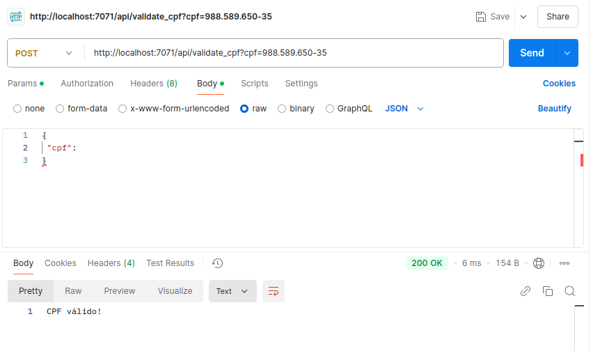
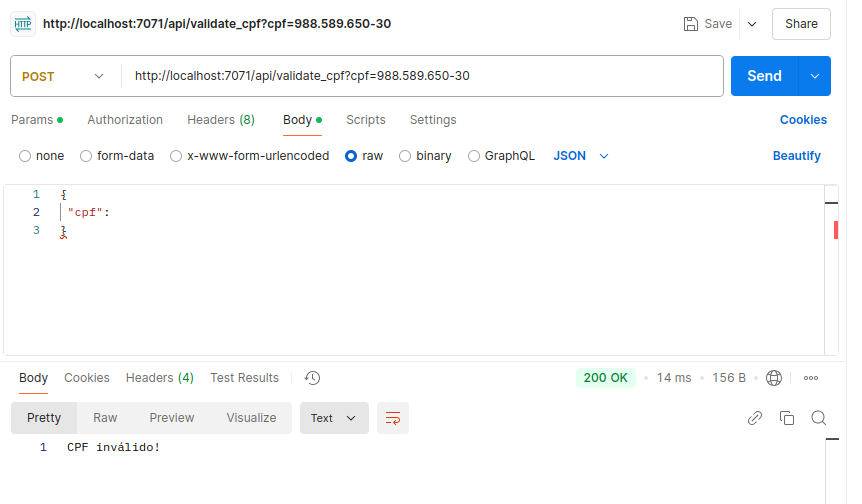
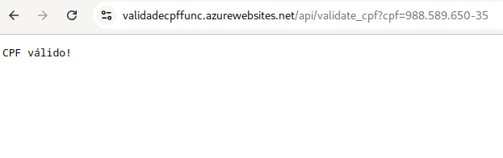
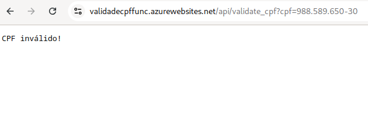

<h1>
<a href="https://www.dio.me/">
     </a>
    <span>Bootcamp Microsoft Certification Challenge #2 AZ-204</span>
</h1>


# :computer: Criando um Microsserviço Serverless para Validação de CPF

Nesse projeto utilizo uma Azure Function para  fazer validação de CPF

# :bulb: Solução do Desafio

Para execução do desafio utilizei a linguagem python, com a qual estou mais acostumado, e o google Gemini 1.5 Pro para auxiliar no passo-a-passo. 

## Pacotes utilizados

- VS Code extensão Azure Functions
- Azure Core Tools (teste local)
- Python 

Foi criado um ambiente virtual do python 3.10 com a extensão Azure Functions e modifiquei o código para implementar a validação do CPF no arquivo `function_app.py`.

## Criando os recursos:

1. **Crie um novo projeto:** No VS Code, pressione F1 para abrir a paleta de comandos. Digite "Azure Functions: Create New Project..." e pressione Enter.
2. **Escolha a pasta do projeto:** Selecione uma pasta vazia para o seu projeto.
3. **Selecione a linguagem:** Escolha "Python" como a linguagem para o seu projeto.
4. **Crie uma Function App no Azure:** Na paleta de comandos, digite "Azure Functions: Create Function App in Azure..." e pressione Enter.
5. **Configure a Function App:**
    * **Selecione uma assinatura:** Escolha a assinatura do Azure que você deseja usar.
    * **Insira um nome exclusivo:** Dê um nome globalmente exclusivo para sua Function App.
    * **Selecione uma pilha de runtime:** Escolha a versão do Python que você deseja usar.
    * **Selecione um local:** Escolha a região do Azure onde você deseja criar sua Function App.
6. **Crie uma função HTTP:** Na paleta de comandos, digite "Azure Functions: Create Function..." e pressione Enter.
7. **Configure a função HTTP:**
    * **Escolha um modelo:** Selecione "HTTP trigger".
    * **Insira um nome para a função:** Dê um nome para sua função.
    * **Escolha um nível de autorização:** Selecione "Function".

```python
# Initialize the app
app = func.FunctionApp()

# Define the HTTP trigger function
@app.function_name(name="ValidateCPF")
@app.route(route="validate_cpf", auth_level=func.AuthLevel.ANONYMOUS)  # Defina o nível de autenticação aqui
```
A rota `"validate_cpf"` é usada na URL para chamar a função. Veja o arquivo `function_app.py`.

## Testando localmente

1. **Instale o Core Tools:**
    * Se você usa Windows, baixe o instalador MSI do site oficial e siga as instruções.
    * Se você usa macOS ou Linux, use seu gerenciador de pacotes favorito (npm, Homebrew, apt-get).

2. **Verifique a instalação:** Abra seu terminal e digite `func --version`. Se a instalação foi bem-sucedida, você verá a versão do Core Tools.

### Executando

1. **Navegue até a pasta do projeto:** No terminal, use o comando `cd` para navegar até a pasta onde você salvou o código da sua função.

2. **Inicie o host do Functions:** Digite o comando `func start` e pressione Enter. O Core Tools iniciará um host local que executará sua função.

3. **Acesse a função:** Teste a função com o Postman com  a URL `http://localhost:7071/api/validate_cpf?cpf=12345678909`. Substitua `12345678909` pelo CPF que você deseja validar.

<p align=center>

</p>

<p align=center>

</p>


## Deploy com a extensão do VS Code:

1. **Abra a paleta de comandos:** Pressione F1 para abrir a paleta de comandos.

2. **Selecione o comando de deploy:** Digite "Azure Functions: Deploy to Function App..." e pressione Enter.

3. **Escolha a Function App:** Selecione a Function App que você criou anteriormente no Azure.

4. **Aguarde o deploy:** A extensão empacotará seu código e o enviará para o Azure. Aguarde até que o processo seja concluído.

### Após o deploy:

* **Acesse a função no Azure:** No portal do Azure, acesse sua Function App e copie a URL da função.
* **Teste a função:** Abra seu navegador e acesse a URL da função, passando o CPF como parâmetro na query string.

<p align=center>

</p>

<p align=center>

</p>


**Dicas:**

* **Configurações:** Antes de fazer o deploy, verifique se as configurações da sua função (como variáveis de ambiente) estão corretas.
* **Monitoramento:** Após o deploy, monitore a função no portal do Azure para verificar se ela está funcionando como esperado.
* **Atualizações:** Para atualizar a função, basta fazer o deploy novamente.

# Obs.: Todos os recursos foram excluídos após os testes.